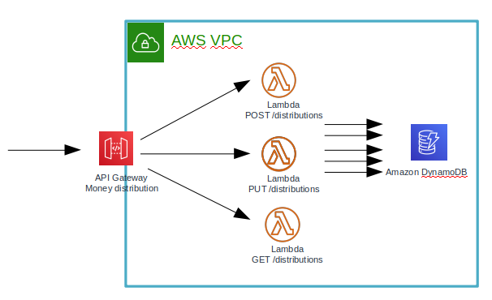

# Money distribution

## Install guide

* 사전 목록
    * 개발 및 배포환경
        * Ubuntu 18.04
        * Java, Gradle
    * AWS cli 설치
    * AWS SAM 설치
    * AWS 계정, AccessKey, SecretKey 설정되야 함
* 설치 script
    * AWS IaC SAM이 배포될 S3 생성
    * AWS DynamoDB 생성
    * AWS Serverless 서비스 생성
        * API-Gateway 및 Lambda(비즈니스 로직)
```bash
$ MoneyDistribution/1-create-bucket.sh
$ MoneyDistribution/2-deploy-dyanamodb.sh
$ MoneyDistribution/2-deploy-api.sh
```

## Infrastructure architecture



## 핵심 문제 해결 전략

* 프로젝트 전체 소스 트리와 구성은 Clean architecture와 유사한 형태로 작성하였습니다.
    * 특정 framework나, 특정 DB(RDB, NoSQL)에도 의존하지 않으려 노력했으며, 변경에 취약 할 수 있는 구체적인 것들로 부터  
    Money distribution의 핵심적인 usecase들이 오염되지 않도록 하기 위함입니다.       

* 현재 서버의 구성은 위 인프라 구성에서도 보이듯이 AWS에서 제공하는 Serverless 서비스들을 이용하여 구성되어 있고, 모든 Infra 구성 및 권한 정보는 IaC(Infrastructure as Code)로 관리하고 있습니다.  
그리고 NoSQL 중 하나인 DynamoDB를 활용하고 있어, OLTP 동작에 매우 효율적이며, 다수의 트래픽에도 PK(token)별로 트래픽 처리가 분산될 수 있습니다.  
비즈니스로직이 포함된 lambda는 사용하는 시간 만큼만 과금이 지불되고, 트래픽에 따른 수평 확장이 가능합니다. 그러나, 실제로 현재 default soft limit 으로 가용한 latency와 TPS 등은 반드시 측정하여 서비스의 성능을 파악할 필요가 있으며, 아직 테스트를 해보지 않았습니다. 

* Known Issue: 
    * 본 프로젝트는 많은 corner-case들을 고려하지 않고 있으니, 오동작에 놀라지 마시기 바랍니다.
    * Token이 길이 3의 문자열이라, 오랜 시간이 지나면 더 이상 유효한 token을 생성하지 못 할 수 있으며, 이에 대한 조치는 하지 않은 상태입니다.
    * 현재 뿌리기 알고리즘 Interface 로 하여, 상위 use-case가 하위 구체적인 분배 알고리즘에 의존하지 않도록 처리 하였고, default 분배 알고리즘인 동등 분배는 특정 케이스(1000원 3명 333원씩)에 1원 정도는 분배하지 않도록 되어 있습니다.  


## API documentation

### Common Response Code

| HTTP Status | Description |
|--------|------|
| 200 |  OK  |
| 400 |  Bad request  |
| 500 |  Internal server error  |


#### Common Error Response Body

| Name | Type | Limit | Required(Y/N) | Description |
|--------|---------|------|------|-----|
| message | String  |  | Y | Error message |


#### Common Error Response Body Sample

```json
{
  "message": "No money distribution available or Not allowed to get money distribution"
}
```

### Common Request Header

| Name | Required(Y/N) | Description |
|--------|------|-----|
| X-USER-ID |  Y  | 요청자 ID |
| X-ROOM-ID |  Y  | 요청자 방 ID |

---------------------------------------------

### POST money distributions

#### Request URL

* **POST {baseURL}/distributions**
* 신규 뿌리기 생성

#### Request Body

| Name | Type | Limit | Required(Y/N) | Description |
|--------|---------|------|------|-----|
| totalAmount | Integer  |  | Y | 총 뿌리기 금액 |
| guestCnt | Integer  |  | Y | 뿌리기 대상이 되는  게스트 인원  |

#### Request Body Sample

```json
{
    "totalAmount": 1000,
    "guestCnt": 3
}
```

#### Response Body

| Name | Type | Limit | Required(Y/N) | Description |
|--------|---------|------|------|-----|
| token | String  |  | Y | 뿌리기 ID가 되는 token, 길이3의 랜덤 문자열 |
| guestCnt | String  |  | Y | 해당 뿌리기의 Link  |

#### Response Body Sample

```json
{
    "token": "f5a",
    "distributionLink": "distributions/f5a"
}
```

---------------------------------------------

### Update money distributions

#### Request URL

* **PUT {baseURL}/distributions**
* 기 생성된 뿌리기 받기 수행

#### Request Body

| Name | Type | Limit | Required(Y/N) | Description |
|--------|---------|------|------|-----|
| token | String  |  | Y | 받기를 수행할 뿌리기 ID(token) |

#### Request Body Sample

```json
{
    "token": "f5a"
}
```

#### Response Body

| Name | Type | Limit | Required(Y/N) | Description |
|--------|---------|------|------|-----|
| money | Integer  |  | Y | 해당 뿌리기로 부터 수신한 금액 |

#### Response Body Sample

```json
{
    "money": 333
}
```

---------------------------------------------

### Get money distributions

#### Request URL

* **GET {baseURL}/distributions/{token}**
* 기 생성된 뿌리기의 상세 정보 조회

#### Request Path Parameter

* **{token}** : 뿌리기 ID

#### Request Body

* N/A

#### Request Body Sample

* N/A

#### Response Body

| Name | Type | Limit | Required(Y/N) | Description |
|--------|---------|------|------|-----|
| token | String  |  | Y | 뿌리기 ID(token) |
| createEpoch | Integer  |  | Y | 뿌리기 생성 Epoch(UNIX time in sec) |
| totalAmount | Integer  |  | Y | 총 뿌리기 금액 |
| distributedAmount | Integer  |  | Y | 뿌리기완료 금액 |
| distributionList | Array of object(distribution)  |  | Y | 뿌리기 정보 리스트 |
| ㄴdistribution | object  |  | Y | 뿌리기 정보 |
| ㄴmoney | Integer  |  | Y | 받은 금액 |
| ㄴuserId | String  |  | Y | 받은 사용자 ID |

#### Response Body Sample

```json
{
  "token": "abc",
  "createEpoch": 1606133306,
  "totalAmount": 1000,
  "distributedAmount": "500",
  "distributionList": [
    {
      "money": 500,
      "userId": "userA"
    }
  ]
}
```
